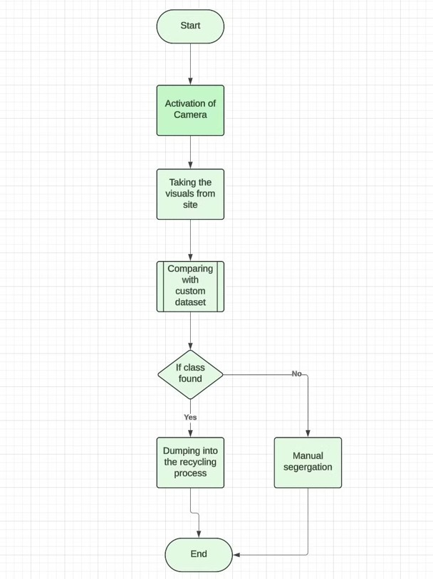
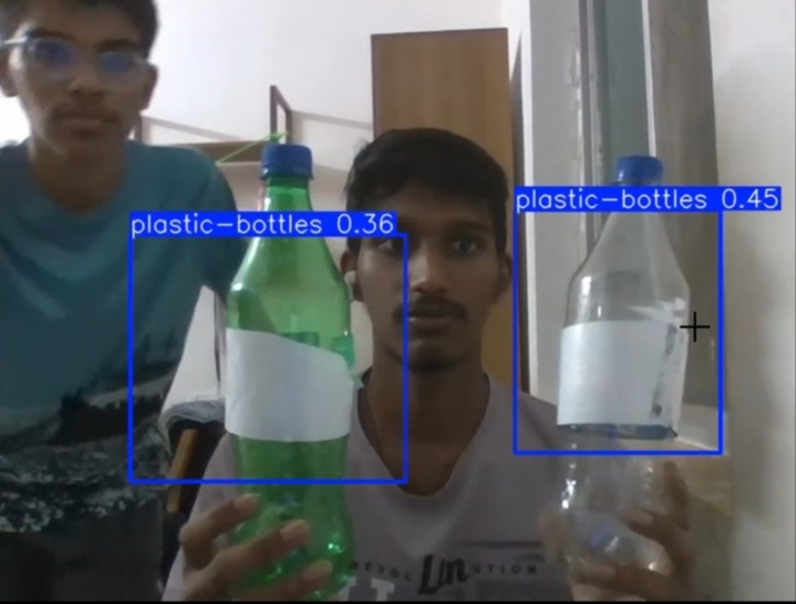
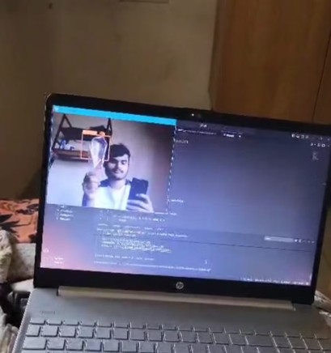
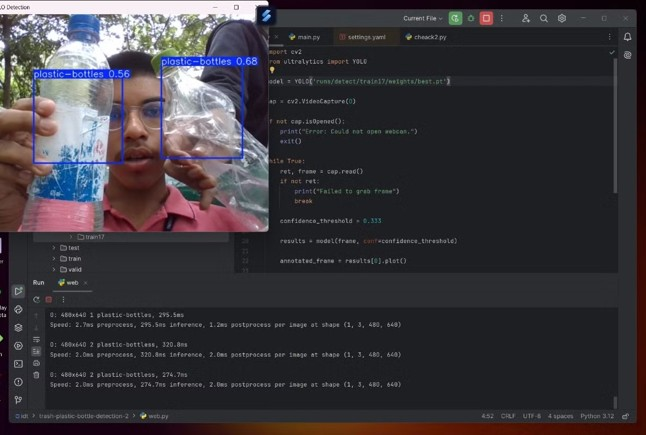

# Plastic Segregation Using Computer Vision

## Table of Contents

- [I. Introduction](#i-introduction)  
- [II. Project Description](#ii-project-description)  
- [III. Methodology](#iii-methodology)  
- [IV. Results](#iv-results)  
- [Sample Output Results](#sample-output-results)  
- [V. Discussion](#v-discussion)  
- [VI. Conclusion](#vi-conclusion)  
- [Dataset & Resources](#dataset--resources)  
- [VII. References](#vii-references)  
- [VIII. Future Scope](#viii-future-scope)  
- [Contributors](#contributors)  

---

## I. Introduction

Plastic waste poses a significant environmental challenge globally. Manual sorting is inefficient and error-prone, making recycling efforts less effective. This project presents a computer vision-based system using YOLO, OpenCV, and Python to automate real-time plastic waste detection and classification.

---

## II. Project Description

This system:

- Captures video/images of plastic waste
- Uses a trained YOLO model for detection
- Employs OpenCV for real-time image processing
- Uses CVAT for dataset annotation

### System Block Diagram

---

## III. Methodology

1. **Data Acquisition** – Images/videos are captured using a camera  
2. **Data Annotation** – CVAT is used to label plastic types with bounding boxes  
3. **Model Training** – YOLOv8 is trained using the annotated dataset  
4. **Real-time Processing** – YOLO + OpenCV are used for real-time detection  
5. **Performance Evaluation** – Evaluated using accuracy and FPS metrics

---

## IV. Results

- **Accuracy**: 93%
- **Real-time speed**: 25 FPS

###  Sample Output Results

| Sample 1 | Sample 2 | Sample 3 |
|----------|----------|----------|
|  |  |  |

---

## V. Discussion

The project demonstrates the power of AI and computer vision in automating waste segregation. Key takeaways:

- Eliminates manual labor
- Enhances sorting speed and accuracy
- Promotes sustainable waste management

---

## VI. Conclusion

With a 93% accuracy and high-speed processing, the system shows real-world potential in smart waste recycling. Future improvements could include multi-material detection, smart bin integration, and robotic arm sorting.

---

## Dataset & Resources

You can download the dataset, trained model, and sample output images from the release below:

 [Download Project Files (v1.0)](https://github.com/milanbhat1/plastic-waste-detection-opencv/releases/tag/v1.0)

---

## VII. References

1. Adeshina SA et al. (2019). _Plastic trash sorting system_  
   [Link](https://doi.org/10.1109/ICECCO48375.2019.9043197)

2. Misha AT et al. (2021). _Plastic garbage detection using image processing_  
   [Link](https://ieeexplore.ieee.org/document/9641188)

---

## VIII. Future Scope

- **Robotic Sorting** – Conveyor belt & robotic integration  
- **Multi-material Support** – Expand detection beyond plastics  
- **Contamination Check** – Quality assurance using CV  
- **Smart Bin Monitoring** – Automated waste classification and logging  
- **Advanced Material Training** – Detect laminates, multilayers, and composites

---

## Contributors

- **Ballambettu Milan Shankar Bhat**  
  USN: `4NI23EC019`
- **Anirudha Jayaprakash**  
  USN: `4NI23EC014`
- **Adithya Y**  
  USN: `4NI23EC005`
- **Nutan Ganesh Hegde**  
  USN: `4NI23EC069`
- **Chandan Shridar Hegde**  
  USN: `4NI23EC022`
- **Daivik I Vinayaka**  
  USN: `4NI23EC023`
---

> Built with: Python • OpenCV • YOLOv8 • CVAT  
> Model Accuracy: 93%  
> Speed: 25 FPS
